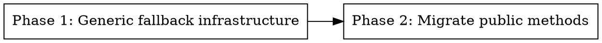

# Plan: Orchestrator Execute Methods Refactor

> **Source:** docs/plans/2026-03-24-orchestrator-execute-refactor-design.md
> **Created:** 2026-03-24
> **Status:** complete

## Goal

Replace 8 near-identical execute methods and 3 fallback chain collectors with 2 generic execute methods and 1 generic collector, eliminating ~350 lines of duplicated code.

## Acceptance Criteria

- [x] Single `_collect_fallback_chain` works for all config types (REQ-001)
- [x] `_execute_with_fallback_async` and `_execute_with_fallback_sync` handle all modalities (REQ-002, REQ-003)
- [x] All modalities have consistent logging (REQ-009)
- [x] `NotImplementedError` is caught and re-raised immediately for all modalities (REQ-008)
- [x] Public API in `api.py` unchanged (REQ-010)
- [x] All existing tests pass
- [x] New tests cover generic methods with all edge cases from spec

## Codebase Context

### Existing Patterns to Follow
- **Orchestrator**: `packages/tarash-gateway/src/tarash/tarash_gateway/orchestrator.py` — the file being refactored
- **Test pattern**: `packages/tarash-gateway/tests/unit/video/test_orchestrator.py` — function-based tests, mock `get_handler` via patch, use `AsyncMock`/`MagicMock`

### Test Infrastructure
- Runner: `uv run pytest packages/tarash-gateway/tests/`
- Note: Tests currently fail to collect due to Pydantic/Python 3.14 RC2 incompatibility. Verify with `uv run pytest packages/tarash-gateway/tests/unit/video/test_orchestrator.py` once environment is fixed, or validate via static analysis (ruff, mypy).

### Key Files
- `orchestrator.py` — 474 lines after refactoring (was 815 lines)
- `models.py` — config types (VideoGenerationConfig L185, ImageGenerationConfig L366, AudioGenerationConfig L531)
- `registry.py` — `get_handler()` accepts union of all config types
- `api.py` — all 8 callers of orchestrator methods

## Phase Graph

